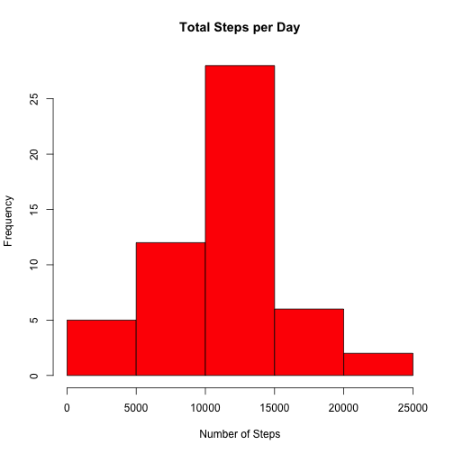
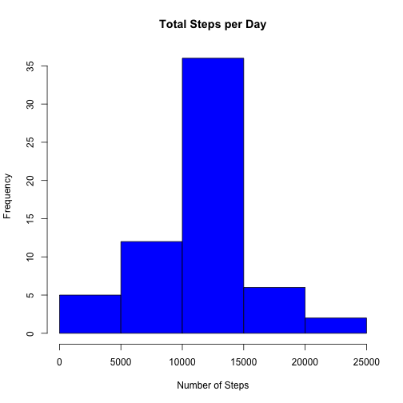
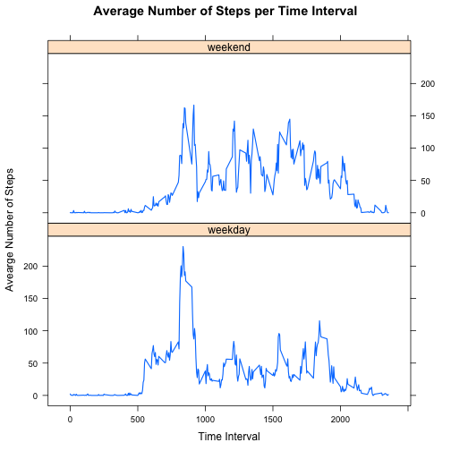

# Reproducible Research: Peer Assessment 1


## Loading and preprocessing the data

First we load the data from the working directory (which is assumed to be the
RepData_PeerAssessment1 folder).


```r
if(!file.exists(paste0(getwd(),"/activity.csv"))) {
    unzip(paste0(getwd(),"/activity.zip"))
}

amd <- read.csv(paste0(getwd(),"/activity.csv"), header = TRUE,
                colClass = c("integer","Date","integer"))
```

## What is mean total number of steps taken per day?

We transform the data to get daily statistics for number of steps (sum, mean,
and median).


```r
library(plyr)
dayStats <- ddply(amd, c("date"), summarize,
                  mean = mean(steps),
                  median = median(steps),
                  total = sum(steps))
```

Using this data, we create a histogram of the total number of steps taken per day.


```r
hist(dayStats$total, col="red", main="Total Steps per Day", xlab="Number of Steps")
```

 

We also give the mean and median number of steps taken per day.


```r
print(dayStats[,1:3])
```

```
##          date    mean median
## 1  2012-10-01      NA     NA
## 2  2012-10-02  0.4375      0
## 3  2012-10-03 39.4167      0
## 4  2012-10-04 42.0694      0
## 5  2012-10-05 46.1597      0
## 6  2012-10-06 53.5417      0
## 7  2012-10-07 38.2465      0
## 8  2012-10-08      NA     NA
## 9  2012-10-09 44.4826      0
## 10 2012-10-10 34.3750      0
## 11 2012-10-11 35.7778      0
## 12 2012-10-12 60.3542      0
## 13 2012-10-13 43.1458      0
## 14 2012-10-14 52.4236      0
## 15 2012-10-15 35.2049      0
## 16 2012-10-16 52.3750      0
## 17 2012-10-17 46.7083      0
## 18 2012-10-18 34.9167      0
## 19 2012-10-19 41.0729      0
## 20 2012-10-20 36.0938      0
## 21 2012-10-21 30.6285      0
## 22 2012-10-22 46.7361      0
## 23 2012-10-23 30.9653      0
## 24 2012-10-24 29.0104      0
## 25 2012-10-25  8.6528      0
## 26 2012-10-26 23.5347      0
## 27 2012-10-27 35.1354      0
## 28 2012-10-28 39.7847      0
## 29 2012-10-29 17.4236      0
## 30 2012-10-30 34.0938      0
## 31 2012-10-31 53.5208      0
## 32 2012-11-01      NA     NA
## 33 2012-11-02 36.8056      0
## 34 2012-11-03 36.7049      0
## 35 2012-11-04      NA     NA
## 36 2012-11-05 36.2465      0
## 37 2012-11-06 28.9375      0
## 38 2012-11-07 44.7326      0
## 39 2012-11-08 11.1771      0
## 40 2012-11-09      NA     NA
## 41 2012-11-10      NA     NA
## 42 2012-11-11 43.7778      0
## 43 2012-11-12 37.3785      0
## 44 2012-11-13 25.4722      0
## 45 2012-11-14      NA     NA
## 46 2012-11-15  0.1424      0
## 47 2012-11-16 18.8924      0
## 48 2012-11-17 49.7882      0
## 49 2012-11-18 52.4653      0
## 50 2012-11-19 30.6979      0
## 51 2012-11-20 15.5278      0
## 52 2012-11-21 44.3993      0
## 53 2012-11-22 70.9271      0
## 54 2012-11-23 73.5903      0
## 55 2012-11-24 50.2708      0
## 56 2012-11-25 41.0903      0
## 57 2012-11-26 38.7569      0
## 58 2012-11-27 47.3819      0
## 59 2012-11-28 35.3576      0
## 60 2012-11-29 24.4688      0
## 61 2012-11-30      NA     NA
```

## What is the average daily activity pattern?

We calculate the average number of steps taken per time interval and create a
time-series.


```r
intStats <- ddply(amd, "interval", summarize,
                  mean = mean(steps,na.rm=TRUE))
                   

plot(intStats$interval, intStats$mean, type="l", xlab="Time Interval",
     ylab="Avearge Number of Steps", main="Average Number of Steps per Time Interval")
```

 

The time interval 835 contains the
most number of steps on average: 206.1698.

## Imputing missing values

The variable "steps" contains 2304 missing values. Since
values are missing from whole days, we could replace missing values with the time
interval means calculated previously.


```r
amdNarm <- amd
for (i in 1:length(amdNarm$steps)) {
   if (is.na(amdNarm$steps[i])) {
       amdNarm$steps[i] <- intStats$mean[intStats$interval == amdNarm$interval[i]]
   }
}

dayStatsNarm <- ddply(amdNarm, "date", summarize,
                      mean = mean(steps),
                      median = median(steps),
                      total = sum(steps))
```

As before, we create a histogram of total number of steps taken per day.


```r
hist(dayStatsNarm$total, col="blue", main="Total Steps per Day", xlab="Number of Steps")
```

 

We also give the mean and median number of steps taken per day.


```r
print(dayStatsNarm[,1:3])
```

```
##          date    mean median
## 1  2012-10-01 37.3826  34.11
## 2  2012-10-02  0.4375   0.00
## 3  2012-10-03 39.4167   0.00
## 4  2012-10-04 42.0694   0.00
## 5  2012-10-05 46.1597   0.00
## 6  2012-10-06 53.5417   0.00
## 7  2012-10-07 38.2465   0.00
## 8  2012-10-08 37.3826  34.11
## 9  2012-10-09 44.4826   0.00
## 10 2012-10-10 34.3750   0.00
## 11 2012-10-11 35.7778   0.00
## 12 2012-10-12 60.3542   0.00
## 13 2012-10-13 43.1458   0.00
## 14 2012-10-14 52.4236   0.00
## 15 2012-10-15 35.2049   0.00
## 16 2012-10-16 52.3750   0.00
## 17 2012-10-17 46.7083   0.00
## 18 2012-10-18 34.9167   0.00
## 19 2012-10-19 41.0729   0.00
## 20 2012-10-20 36.0938   0.00
## 21 2012-10-21 30.6285   0.00
## 22 2012-10-22 46.7361   0.00
## 23 2012-10-23 30.9653   0.00
## 24 2012-10-24 29.0104   0.00
## 25 2012-10-25  8.6528   0.00
## 26 2012-10-26 23.5347   0.00
## 27 2012-10-27 35.1354   0.00
## 28 2012-10-28 39.7847   0.00
## 29 2012-10-29 17.4236   0.00
## 30 2012-10-30 34.0938   0.00
## 31 2012-10-31 53.5208   0.00
## 32 2012-11-01 37.3826  34.11
## 33 2012-11-02 36.8056   0.00
## 34 2012-11-03 36.7049   0.00
## 35 2012-11-04 37.3826  34.11
## 36 2012-11-05 36.2465   0.00
## 37 2012-11-06 28.9375   0.00
## 38 2012-11-07 44.7326   0.00
## 39 2012-11-08 11.1771   0.00
## 40 2012-11-09 37.3826  34.11
## 41 2012-11-10 37.3826  34.11
## 42 2012-11-11 43.7778   0.00
## 43 2012-11-12 37.3785   0.00
## 44 2012-11-13 25.4722   0.00
## 45 2012-11-14 37.3826  34.11
## 46 2012-11-15  0.1424   0.00
## 47 2012-11-16 18.8924   0.00
## 48 2012-11-17 49.7882   0.00
## 49 2012-11-18 52.4653   0.00
## 50 2012-11-19 30.6979   0.00
## 51 2012-11-20 15.5278   0.00
## 52 2012-11-21 44.3993   0.00
## 53 2012-11-22 70.9271   0.00
## 54 2012-11-23 73.5903   0.00
## 55 2012-11-24 50.2708   0.00
## 56 2012-11-25 41.0903   0.00
## 57 2012-11-26 38.7569   0.00
## 58 2012-11-27 47.3819   0.00
## 59 2012-11-28 35.3576   0.00
## 60 2012-11-29 24.4688   0.00
## 61 2012-11-30 37.3826  34.11
```

Because we are missing whole days, the statistics for each of the missing days
are identical and the medians are a lot higher. Since the new total number of 
steps for these days is 10766.1887 the only change in the histogram 
is the increase in frequency for the range 10,000-15,000.

## Are there differences in activity patterns between weekdays and weekends?

We start by creating a part of the week (pow) factor variable. Since the calculation
takes a bit of time, we cache the results.


```r
for (i in 1:length(amdNarm$date)) {
    if (weekdays(amdNarm$date[i]) == "Saturday" | weekdays(amdNarm$date[i]) ==
            "Sunday") { amdNarm$pow[i] <- "weekend"
    } else { amdNarm$pow[i] <- "weekday" }
}
amdNarm$pow <- as.factor(amdNarm$pow)
```

We then create a panel plot showing the average number of steps taken per time 
interval for weekdays and weekends.


```r
intStatsPow <- ddply(amdNarm, c("interval","pow"), summarize,
                     mean = mean(steps))

library(lattice)
xyplot(intStatsPow$mean ~ intStatsPow$interval | intStatsPow$pow, type="l", 
       lwd=1.5, layout = c(1,2), main="Average Number of Steps per Time Interval",
       xlab="Time Interval", ylab="Avearge Number of Steps")
```

 
